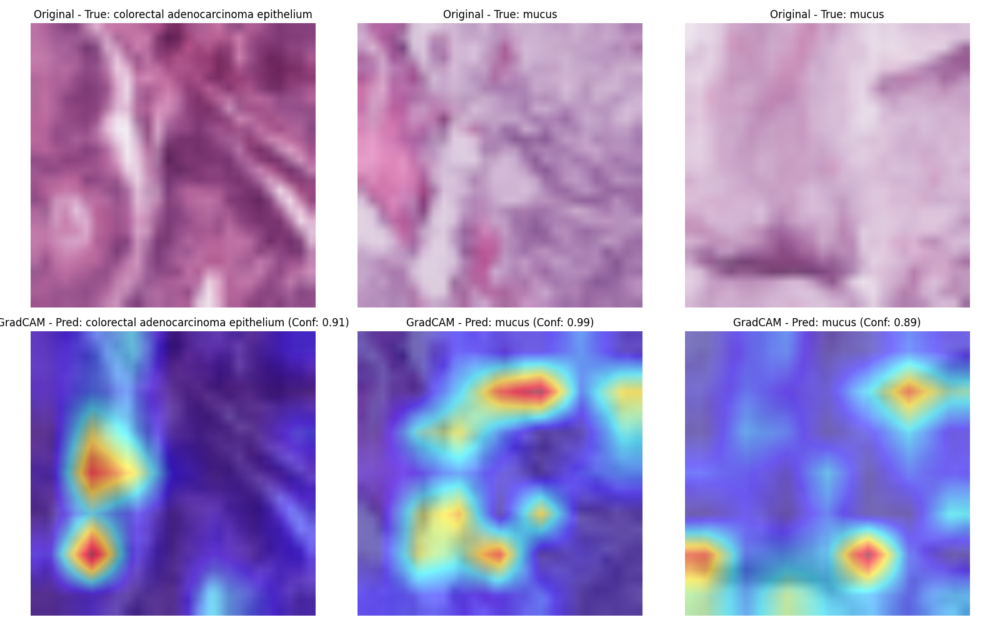

# PathMNIST Classification with Explainable AI

This project implements deep learning models for the classification of PathMNIST dataset with explainable AI techniques to visualize what features the model focuses on when making predictions.

## Overview

The [PathMNIST](https://medmnist.com/) dataset is part of the MedMNIST collection, containing colorectal cancer histology images with 9 classes. This project:

1. Implements both a custom CNN and a transfer learning approach using ResNet50
2. Trains the models on PathMNIST data
3. Applies GradCAM to visualize model decision-making

## Requirements

```
torch
torchvision
numpy
matplotlib
medmnist
grad-cam
```

## Project Structure

```
.
├── data                     # Data storage directory
├── saved_model              # Directory for saved model weights
├── main.py                  # Main execution script
├── src
│   ├── data.py              # Data loading and preprocessing
│   ├── model.py             # Model architecture definitions
│   ├── train.py             # Training and testing scripts
│   ├── grad_cam.py          # GradCAM visualization
└── logs.log                 # Log file
```

## Usage

1. Clone the repository
2. Install the required packages:
   ```
   pip install -r requirements.txt
   ```
3. Run the main script:
   ```
   python main.py
   ```

## Explainable AI

This project implements GradCAM to visualize which parts of an image the model is focusing on for classification. The visualization highlights the regions most influential for the model's prediction.

## Results

The model achieves strong performance on the PathMNIST dataset, achieving an accuracy of 88.97% using transfer learning with ResNet-50. GradCAM visualizations show the model correctly focuses on relevant histological features for classification.



## References

- [MedMNIST Dataset](https://medmnist.com/)
- [GradCAM: Visual Explanations from Deep Networks](https://arxiv.org/abs/1610.02391)
- [ResNet: Deep Residual Learning](https://arxiv.org/abs/1512.03385)
